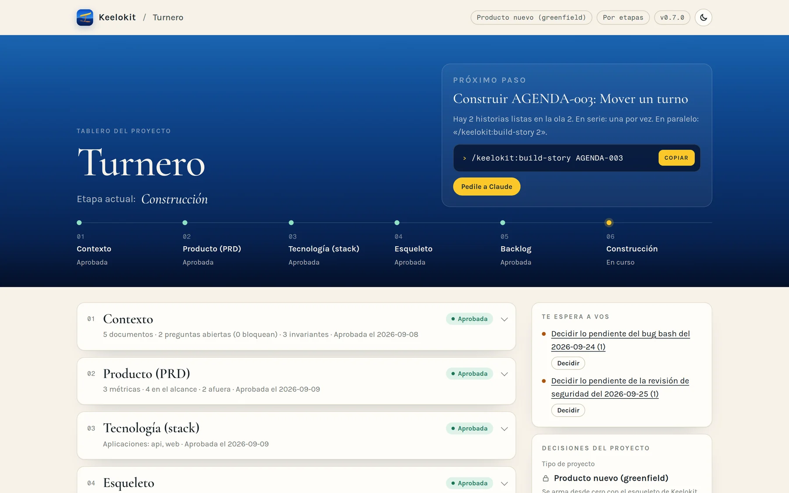

<p align="center"></p>

# Keelokit

<p align="center"><a href="https://keelokit.com/?ref=built-with"></a></p>

**Un harness de Claude Code para construir aplicaciones en monorepos TypeScript.**

*[keelokit.com](https://keelokit.com) · [Read in English](README.md)*

<p align="center"><a href="https://github.com/leosimini/keelokit/releases/latest/download/keelokit-plugin.zip"><b>⬇ Descargá la última versión desde GitHub</b></a> (<code>keelokit-plugin.zip</code>) · <a href="https://github.com/leosimini/keelokit/releases">todas las versiones</a><br>
<sub>El plugin listo para instalar: en Claude, <i>Customize → Plugins → Upload</i>. El zip de cada versión está en su página de release.</sub></p>

Hace muchos años que escribo software y casi toda la vida que emprendo cosas. Los agentes de
código cambiaron mi forma de construir: ideas que antes esperaban un equipo o un mes libre ahora
tienen una primera versión real. Keelokit es el harness que uso para eso —mi stack, mis reglas,
mi forma de trabajar— y lo mantengo como hobby, los fines de semana y en noches de música y
código, aprendiendo sobre la marcha.

Lo comparto por si le sirve a alguien que está dando sus primeros pasos con agentes, o a
emprendedores y equipos —técnicos o no— que están armando la base de su primer MVP. Es opinado y
está hecho a mi gusto, así que no va a encajar en todos los proyectos ni en todos los equipos.
Tomá lo que te sirva.

## La idea

Cuando construyo con agentes, las reglas importantes no pueden vivir solo en un prompt. Por eso en
Keelokit cada regla apunta a algo que la verifica —un test, una regla de lint, un hook de git, un job
de CI— y un script chico (`doctor`) avisa cuando una regla se quedó sin su verificación. Lo que
no se sabe queda escrito como pregunta abierta en vez de adivinarse, y el agente que escribe el
código no es el que dice que está terminado.

## Qué hace

| Comando | Qué pasa |
|---|---|
| `/keelokit` | Dónde está el proyecto, qué sigue y qué espera tu decisión |
| **Proyecto** | |
| `/keelokit:project-new` | De una idea a un esqueleto que funciona: una entrevista que escribe el contexto del producto, un PRD corto, el stack, un monorepo generado con CI y un primer backlog |
| `/keelokit:project-adopt` | Para un repo existente: suma solo el harness (`.keelokit/`), mapea sus reglas a los checks que el repo ya tiene, deja el resto como excepciones con fecha y muestra en el tablero lo que encontró |
| `/keelokit:project-dashboard` | La página desde la que trabajás, siempre al día: dónde está el proyecto, el próximo paso con su comando para copiar, lo que te espera, las olas de desarrollo con cada historia, la salud y los entornos |
| `/keelokit:project-report` | El estado completo, de solo lectura: cada etapa con sus documentos, los bug bashes, las revisiones de seguridad, las decisiones y el historial, para compartir o exportar como archivo |
| **Planificar** | |
| `/keelokit:plan-intake` | Lee lo que ya tenés y pregunta solo lo que falta; lo que nadie sabe todavía queda como pregunta abierta |
| `/keelokit:plan-backlog` | Épicas e historias con escenarios de aceptación y los invariantes que cuidan, agrupadas para que el trabajo en paralelo no toque los mismos archivos ni la misma área crítica |
| **Construir** | |
| `/keelokit:build-story` | Una historia: un verificador escribe primero los tests de aceptación, un builder los hace pasar, un revisor lee el diff, un breaker intenta romperla (de nuevo después del rebase si main avanzó) y el verificador la recorre en la app corriendo |
| **Revisar** | |
| `/keelokit:check-bugbash` | Una cacería de bugs en datos, API, integridad, UX, i18n, accesibilidad, seguridad y más; cada bug que se escapó suma un check para toda su clase, para que no vuelva. Corre como workflow (`/workflows` lo muestra en vivo) donde Claude Code los tiene |
| `/keelokit:check-security` | Seguridad y privacidad a fondo: un mapa de los datos personales, la ley de privacidad de cada mercado, un modelo de amenazas de los recorridos críticos, escaneos de dependencias y de staging; corrige con un test y un control por clase |
| `/keelokit:check-health` | ¿Cada regla sigue verificada? Sumar una regla, registrar una excepción |
| **Publicar** | |
| `/keelokit:ship-setup` | Staging y producción para quien nunca desplegó nada: una guía con un checklist por entorno, los pasos que no necesitan tus credenciales resueltos por Keelokit, y cada uno verificado |
| `/keelokit:ship-release` | Una versión del producto: notas de lo que entró, un tag `vX.Y.Z` después de tu sí, y producción solo cuando una persona lo aprueba en GitHub |
| **Harness** | |
| `/keelokit:harness-upgrade` | Mantenimiento del harness, no de tu app: trae al proyecto las reglas y los controles nuevos de Keelokit, en una rama, sin tocar el código del producto |

## Seguir el avance

<p align="center"></p>

No hace falta leer logs de agentes para saber dónde está todo. `/keelokit:project-dashboard` arma una
página corta desde el repo, en tu idioma y con el look de [keelokit.com](https://keelokit.com), y la
mantiene en vivo: cada actualización cambia la página abierta sin volver a pasarla por el chat.

- **Dónde estás y el próximo paso:** las etapas como una línea de avance, lo único que hay que
  hacer ahora y su comando, listo para copiar.
- **Lo que te espera:** aprobaciones, decisiones que dejó un bug bash o una revisión de seguridad
  (con la opción recomendada), entornos a medio configurar, actualizaciones del harness; cada una
  con su pedido listo para copiar o enviar a la sesión de Claude que mira el tablero.
- **Olas de desarrollo:** cada historia bajo su ola, con el link a su archivo en el repo: hecha,
  lista para construir (copiá su comando) o esperando a otra.
- **Salud y entornos:** el doctor, el último bug bash y la última revisión de seguridad, staging y
  producción, y los links a los documentos del proyecto.

Para otra persona, o para guardar una copia, `/keelokit:project-report` genera el **reporte
completo**: de solo lectura, con cada etapa y sus documentos, lo que encontró cada bug bash y cada
revisión de seguridad, las decisiones y el historial, como página para compartir o archivo HTML
para exportar.

Al empezar elegís, una sola vez, cómo trabaja Keelokit: **por etapas** (se detiene para que
revises cada una) o **automático** (avanza solo y se detiene únicamente donde hace falta una
persona: preguntas que solo vos podés responder, el PRD, cuentas, producción, dinero, temas
legales), y si las historias se construyen de a una o varias en paralelo.

## El stack que genera

<picture>
  <source media="(prefers-color-scheme: dark)" srcset="docs/assets/stack-dark.svg">
  
</picture>

pnpm workspaces · TypeScript strict · NestJS + Prisma + PostgreSQL · Vite + React · Expo · Astro ·
contratos zod e i18n en un paquete compartido · tokens de diseño en otro · Vitest, Jest,
Playwright con axe · GitHub Actions · Fly.io. Elegís qué apps necesita cada producto. Los motivos
están en [`template/.keelokit/harness/stack.md`](template/.keelokit/harness/stack.md).

## Probarlo

Necesitás Node 22 con pnpm 10, Python 3.11+, [uv](https://docs.astral.sh/uv/) (corre
[Copier](https://copier.readthedocs.io/)), Docker y git. macOS o Linux.

```bash
claude plugin marketplace add leosimini/keelokit
claude plugin install keelokit@keelokit
```

O [descargá `keelokit-plugin.zip`](https://github.com/leosimini/keelokit/releases/latest/download/keelokit-plugin.zip) y subilo en Claude (*Customize → Plugins → Upload*).

Después, en una carpeta vacía, abrí Claude Code y corré `/keelokit:project-new`. En un repo que ya
tenés, `/keelokit:project-adopt`. Para generar desde tu propio fork: `KEELOKIT_TEMPLATE=gh:<vos>/keelokit`.

## Bueno saber

- Es opinado a propósito. Si tu stack es otro, `project-adopt` igual te da las reglas, el guard y los
  checks, pero no el esqueleto.
- `build-story` y `check-bugbash` usan varios agentes por historia y consumen más tokens que un chat solo.
  Para cambios chicos existe `build-story --light`.
- El guard que frena a los agentes para que no salteen hooks ni escriban secretos es un reductor
  de velocidad, no un sandbox. Los hooks de git y el CI son el respaldo real.
- Los hooks del plugin corren el `.keelokit/bin/guard.py` y el `doctor.py` del propio proyecto,
  en cada sesión y en cada llamada a una herramienta. Abrir un repo con Keelokit prendido es
  correr su código de `.keelokit/`: hacelo solo con repos cuyo `.keelokit/` te dé confianza, como
  harías con sus tests.
- `doctor` puede ver que un check existe y está prendido, no que sea un buen check. En el código
  crítico eso lo mide el mutation testing; en el resto, las revisiones y las cacerías de bugs.
- Los bugs vienen en clases, así que el harness apunta a clases: las reglas que siempre tienen
  que cumplirse (los totales cierran, un aviso sale una sola vez, un límite aguanta dos requests
  a la vez) se escriben como invariantes y se prueban con tests de propiedades, de concurrencia
  y de repetición; el código donde un bug cuesta más se marca como área crítica y se construye
  de a una historia. Ver [`docs/design.md`](docs/design.md#bugs-come-in-classes).
- Los skills entienden pedidos en español y en inglés.

## Datos y red

Keelokit no tiene servidor propio y no recolecta nada. Lo que escribe (contexto, PRD, backlog,
código) queda en tu repo. El tráfico de red es el que ya hacen tus herramientas de siempre:

- **GitHub:** `project-new`, `project-adopt` y `harness-upgrade` bajan el template con Copier
  (`gh:leosimini/keelokit`, o tu fork con `KEELOKIT_TEMPLATE`). `project-new` pregunta antes de
  crear un repo privado con `gh repo create --push`, que sube tu código a tu cuenta.
- **Registros de paquetes y Docker Hub:** para instalar las dependencias e imágenes del proyecto generado.
- **Fly.io:** solo el CI del proyecto generado hace deploy ahí, con un secret `FLY_API_TOKEN`
  que creás vos en la configuración del repo. El plugin nunca lo lee.
- **claude.ai:** donde Claude puede publicar páginas, el tablero se publica como Artifact
  privado en tu cuenta, con los documentos de tu producto; sus tipografías se cargan de Google
  Fonts. En una terminal es un archivo HTML local. El link del Artifact queda commiteado en
  `.keelokit/state.toml`, así todo el equipo abre el mismo tablero. El link solo no le da acceso a
  nadie a un Artifact privado, pero en un repo público cualquiera puede ver que existe.

La entrevista no registra datos personales de personas reales: las cuentas se nombran por rol,
nunca con credenciales.

## Cómo está hecho

[`docs/design.md`](docs/design.md) explica las piezas: el plugin, el template, las reglas de la
casa y qué puede ver `doctor` y qué no. Keelokit se prueba a sí mismo:
`python3 -m unittest discover -s tests` para el guard, `doctor` y el dashboard, y `scripts/test-template.sh`
para generar proyectos y correr todos sus checks. Las versiones se publican según
[`docs/releasing.md`](docs/releasing.md).

## Ideas de las que aprendí

El desarrollo guiado por especificaciones ([OpenSpec](https://github.com/Fission-AI/OpenSpec),
[Spec Kit](https://github.com/github/spec-kit)), [Superpowers](https://github.com/obra/superpowers)
por separar quién construye de quién revisa, [Copier](https://copier.readthedocs.io/) por los
templates que se pueden actualizar, y mucha prueba y error en mis propios proyectos.

## Licencia

MIT — ver [LICENSE](LICENSE). Hecho por [Leopoldo Simini](https://leopoldosimini.com).
