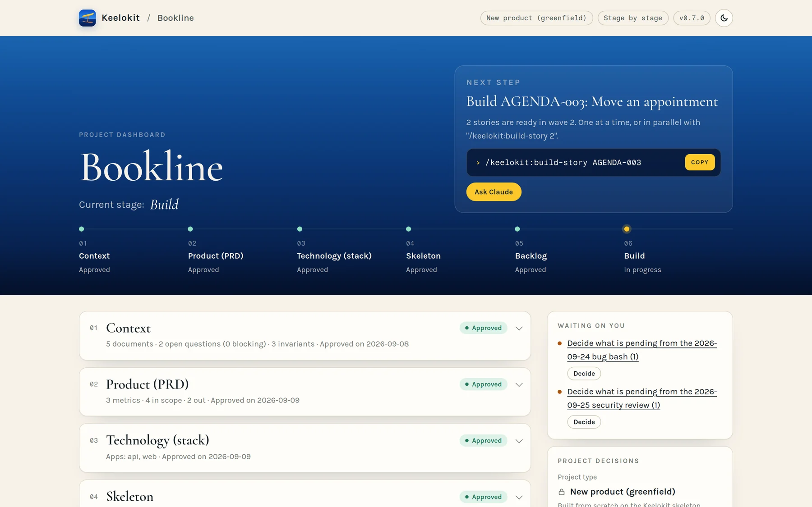
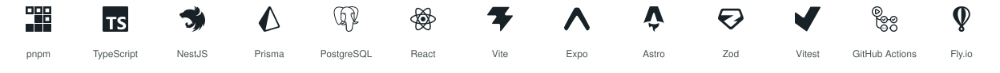

<p align="center"></p>

# Keelokit

<p align="center"><a href="https://keelokit.com/?ref=built-with"></a></p>

**A Claude Code harness for building apps in TypeScript monorepos.**

*[keelokit.com](https://keelokit.com) · [Leer en español](README.es.md)*

<p align="center"><a href="https://github.com/leosimini/keelokit/releases/latest/download/keelokit-plugin.zip"><b>⬇ Download the latest version from GitHub</b></a> (<code>keelokit-plugin.zip</code>) · <a href="https://github.com/leosimini/keelokit/releases">all versions</a><br>
<sub>The plugin ready to install: in Claude, <i>Customize → Plugins → Upload</i>. Each version's zip is on its release page.</sub></p>

I've been writing software for many years and starting things for most of my life. Coding agents
changed how I build: ideas that used to wait for a team or a free month now get a real first
version. Keelokit is the harness I use for that — my stack, my rules, the way I like to work —
and I maintain it as a hobby, on weekends and late nights with music on, learning as I go.

I'm sharing it in case it helps someone taking their first steps with agents, or founders and
teams — technical or not — laying the foundation of a first MVP. It is opinionated and built
around my preferences, so it won't fit every project or every team. Take what's useful.

## The idea

When I build with agents, the rules that matter shouldn't live only in a prompt. So in Keelokit each
rule points to something that checks it — a test, a lint rule, a git hook, a CI job — and a
small script (`doctor`) tells you when a rule has lost its check. Unknown facts become written
gaps instead of guesses, and the agent that writes the code isn't the one that says it's done.

## What it does

| Command | What happens |
|---|---|
| `/keelokit` | Where the project is, what's next, what's waiting for you |
| **Project** | |
| `/keelokit:project-new` | From an idea to a working skeleton: an interview that writes the product context, a short PRD, the stack, a generated monorepo with CI, and a first backlog |
| `/keelokit:project-adopt` | For an existing repo: adds only the harness (`.keelokit/`), maps its rules to the checks the repo already has, lists the rest as dated exceptions, and shows on the dashboard what it found |
| `/keelokit:project-dashboard` | The page you work from, kept live: where the project is, the next step with its command to copy, what waits for you, the development waves with every story, health and environments |
| `/keelokit:project-report` | The complete status, read-only: every stage with its documents, bug bashes, security reviews, decisions and history, to share or export as a file |
| **Plan** | |
| `/keelokit:plan-intake` | Reads what you already have, then asks only what's missing; what nobody knows yet is written down as an open question |
| `/keelokit:plan-backlog` | Epics and stories with acceptance scenarios and the invariants they keep, grouped so parallel work doesn't touch the same files or the same critical area |
| **Build** | |
| `/keelokit:build-story` | One story: a verifier writes the acceptance tests first, a builder makes them pass, a reviewer reads the diff, a breaker tries to break it (again after rebasing if main moved), the verifier walks it in the running app |
| **Run** | |
| `/keelokit:run-local` | Your Expo app and its API on an Android phone or an iOS simulator, with one command: it looks at what your Mac is missing, shows you, installs with one yes, and if something fails it keeps the error so Claude can fix it and try again |
| **Check** | |
| `/keelokit:check-bugbash` | A bug hunt across data, API, integrity, UX, i18n, accessibility, security and more; every bug that got through adds a check for its whole class so it doesn't come back. Runs as a workflow (`/workflows` shows it live) where Claude Code has them |
| `/keelokit:check-security` | Security and privacy in depth: a map of the personal data, the privacy law of each market, a threat model of the critical journeys, dependency and staging scans; fixes with a test and a check per class |
| `/keelokit:check-health` | Is every rule still checked? Add a rule, register an exception |
| **Ship** | |
| `/keelokit:ship-setup` | Staging and production for people who have never deployed: a guide with a checklist per environment, the steps that need none of your credentials done for you, each one verified |
| `/keelokit:ship-release` | A version of the product: release notes from what landed, a `vX.Y.Z` tag after your yes, and production only after a person approves it in GitHub |
| **Harness** | |
| `/keelokit:harness-upgrade` | Maintenance of the harness, not of your app: brings Keelokit's newer rules and checks into the project, on a branch, without touching its product code |

## Following along

<p align="center"></p>

You don't need to read agent logs to know where things are. `/keelokit:project-dashboard` builds one
short page from the repo, in your language, with the look of [keelokit.com](https://keelokit.com),
and keeps it live: each refresh updates the open page without sending it through the chat again.

- **Where you are and the next step:** the stages as a stepper, the one thing to do next and its
  command, ready to copy.
- **What waits for you:** approvals, decisions a bug bash or a security review left (with the
  recommended option), environments still being set up, harness updates — each with its request
  ready to copy or send to the Claude session watching the page.
- **Development waves:** every story under its wave, linked to its file in the repo, done, ready
  to build (copy its command) or waiting for another.
- **Health and environments:** the doctor, the last bug bash and security review, staging and
  production — and links to the project's documents.

For someone else, or to keep a copy, `/keelokit:project-report` generates the **full report**:
read-only, every stage with its documents, the findings of every bug bash and security review,
the decisions and the history — as a page to share or an HTML file to export.

At the start you choose, once, how Keelokit works: **stage by stage** (it stops for you to
review each stage) or **automatic** (it goes on alone and stops only where a person is required:
questions only you can answer, the PRD, accounts, production, money, legal), and whether stories
are built one at a time or several in parallel.

## The stack it generates

<picture>
  <source media="(prefers-color-scheme: dark)" srcset="docs/assets/stack-dark.svg">
  
</picture>

pnpm workspaces · TypeScript strict · NestJS + Prisma + PostgreSQL · Vite + React · Expo ·
Astro · zod contracts and i18n in a shared package · design tokens in another · Vitest, Jest,
Playwright with axe · GitHub Actions · Fly.io. You pick which apps a product needs. The reasons
are in [`template/.keelokit/harness/stack.md`](template/.keelokit/harness/stack.md).

## Try it

You need Node 22 with pnpm 10, Python 3.11+, [uv](https://docs.astral.sh/uv/) (it runs
[Copier](https://copier.readthedocs.io/)), Docker, and git. macOS or Linux.

```bash
claude plugin marketplace add leosimini/keelokit
claude plugin install keelokit@keelokit
```

Or [download `keelokit-plugin.zip`](https://github.com/leosimini/keelokit/releases/latest/download/keelokit-plugin.zip) and upload it in Claude (*Customize → Plugins → Upload*).

Then, in an empty folder, open Claude Code and run `/keelokit:project-new`. In a repo you already
have, run `/keelokit:project-adopt`. To generate from your own fork, set `KEELOKIT_TEMPLATE=gh:<you>/keelokit`.

`/keelokit:run-local` works on macOS only for now. I have run the iOS simulator on an Intel Mac with
Xcode 26; a real Android phone, Expo Go and Apple Silicon I haven't tried, so treat those paths as
untested.

## Good to know

- It's opinionated on purpose. If your stack is different, `project-adopt` still gives you the rules,
  the guard and the checks, but not the skeleton.
- `build-story` and `check-bugbash` run several agents per story; they use more tokens than a single chat.
  `build-story --light` exists for small changes.
- The guard that stops agents from bypassing hooks or writing secrets is a speed bump, not a
  sandbox. The git hooks and CI are the real backstop.
- The plugin's hooks run the project's own `.keelokit/bin/guard.py` and `doctor.py`, on every
  session and every tool call. Opening a repo with Keelokit on means running its `.keelokit/`
  code, so only do it with repos whose `.keelokit/` you trust, as you would with their tests.
- `doctor` can tell a check is present and switched on, not that it's a good check. For the
  critical code, mutation testing measures that; elsewhere, reviews and bug hunts cover it.
- Bugs come in classes, so the harness aims at classes: the rules that must always hold
  (totals add up, a notice goes out once, a limit holds with two requests at once) are written
  as invariants and proven with property, concurrency and replay tests; the code where a bug
  costs most is listed as a critical area and built one story at a time. See
  [`docs/design.md`](docs/design.md#bugs-come-in-classes).
- Skills understand requests in English and Spanish.

## Data and network

Keelokit has no server of its own and collects nothing. What it writes (context, PRD, backlog,
code) stays in your repo. The network traffic is the one your usual tools already make:

- **GitHub:** `project-new`, `project-adopt` and `harness-upgrade` fetch the template with Copier
  (`gh:leosimini/keelokit`, or your fork via `KEELOKIT_TEMPLATE`). `project-new` asks before
  creating a private repo with `gh repo create --push`, which pushes your code to your account.
- **Package registries and Docker Hub:** installing the generated project's dependencies and images.
- **Fly.io:** only the generated project's CI deploys there, with a `FLY_API_TOKEN` secret you
  create in your repo's settings. The plugin never reads it.
- **claude.ai:** where Claude can publish pages, the dashboard is published as a private
  Artifact in your account, with your product documents in it; its fonts load from Google Fonts.
  In a terminal it is a local HTML file. The Artifact's link is committed in
  `.keelokit/state.toml`, so the whole team opens the same dashboard. The link alone gives nobody
  access to a private Artifact, but in a public repo anyone can see that it exists.

The interview doesn't record personal data of real people: accounts are named by role, never
with credentials.

## How it's built

[`docs/design.md`](docs/design.md) explains the pieces: the plugin, the template, the house rules,
and what `doctor` can and can't see. Keelokit tests itself: `python3 -m unittest discover -s tests`
for the guard, doctor and dashboard, and `scripts/test-template.sh` to generate projects and run their full
checks. Releases follow [`docs/releasing.md`](docs/releasing.md).

## Ideas I learned from

Spec-driven development ([OpenSpec](https://github.com/Fission-AI/OpenSpec),
[Spec Kit](https://github.com/github/spec-kit)), [Superpowers](https://github.com/obra/superpowers)
for separating who builds from who reviews, [Copier](https://copier.readthedocs.io/) for templates
that can be upgraded, and a lot of trial and error on my own projects.

## License

MIT — see [LICENSE](LICENSE). Made by [Leopoldo Simini](https://leopoldosimini.com).
